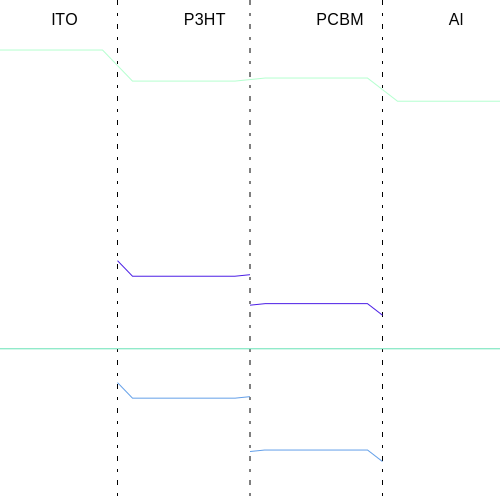
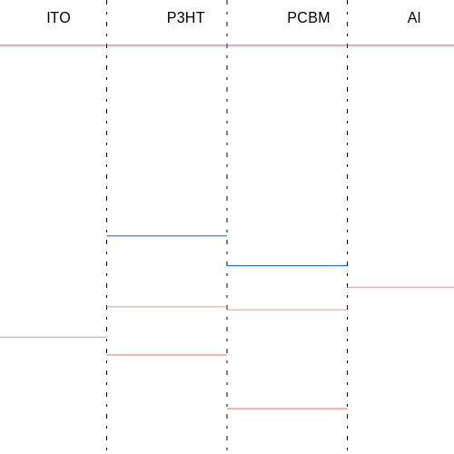

BandDiagram.js [](http://unlicense.org/)
==============

This is a tool allowing you to build schematic [band diagrams](https://en.wikipedia.org/wiki/Band_diagram) in [SVG](https://developer.mozilla.org/ru/docs/Web/SVG) using [Anderson's Rule](https://en.wikipedia.org/wiki/Anderson's_rule).

I haven't created the constructor because it is more convenient for me to use this as a library, alternating the source code.

How-to use
----------

Very easy indeed:
```js
	let front = new Material({Fermi : -4.9}, "ITO"); //Creates a layer, the material is Indium Tin Oxide, the origin is vacuum level
	let acc = new Material({HOMO : -5.2, LUMO : -3.2, Fermi : -4.39}, "P3HT"); //an acceptor organic semiconductor: poly(3-hexyl)thiophene
	let don = new Material({HOMO : -6.1, LUMO : -3.7, Fermi : -4.44}, "PCBM"); //a donor organic semiconductor: [6,6]-phenyl C61 butyric acid methyl ester
	let rear = new Material({Fermi : -4.06}, "Al"); //the rear contact: aluminum

	let h = new Hetero([front, acc, don, rear]); //Assemble the heterostructure
	h.align(); //align the Fermi levels of the heterostructure
	//h.align("vacuum");//or you can align vacuum level
	h.draw(null, 500, 500, 50); //returns SVG, the first argument is SVG.js object (if you want to draw on existing svg), then width, height and offset from top;
```

Helpers and Sugar
-----------------
You can use ```AutoKeyedStorage``` to store and retrieve materials (it is also suitable to store anything else, so feel free to reuse). It's just a [```Map```](https://developer.mozilla.org/ru/docs/Web/JavaScript/Reference/Global_Objects/Map) with 2 useful properties:
* you can access its content using ```.``` and ```[]```
* you can add elements w/o keys using ```add```, the keys will be derived automatically (by default they are taken from name attribute).

For example, you can write
```js
let materials=new AutoKeyedStorage();
... //fill it with materials
let h=new Hetero("ITO/P3HT/PCBM/Al".split("/").map(ln => materials[ln]).filter((e)=>!!e));
```
.

All the classes are [iterables](https://developer.mozilla.org/en-US/docs/Web/JavaScript/Reference/Iteration_protocols) (you can use them in ```for ... of``` loops and convert to arrays with Array.from()) and [enumerables](https://developer.mozilla.org/en-US/docs/Web/JavaScript/Reference/Global_Objects/Proxy/handler/enumerate) (you can use them in ```for ... in``` loops and use ```Object.*``` methods).

Tweaking
--------
* you can change [Fermi level](https://en.wikipedia.org/wiki/Fermi_level) name using ```Hetero::FermiLevelName```
* you can assign custom colors to levels by their name using ```Hetero::colorMapping```
* you can change color mapping to your own by redefining ```Hetero::getColorFromName```, for example you can choose colors from the predefined list or hash level name for example with crc32 and derive color from the hash value.

Examples
--------

